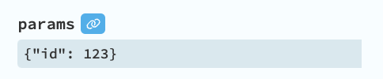

# Navigation Components

A Navigation Component is useful over a Button with a click handler because it supports `Ctrl/Cmd` clicking a route to open in a new tab and should provide the correct href value for the browser.

The routing library provides two Navigation Components:

-   [NavLink](#navlink)
-   [Anchor](#anchor)

Navigation Components by default are subclasses of the `anvil.Link` component. However, this can be customised. See [Themes](../theme/index.md) for details.

## NavLink

The NavLink component is a link that you will likely use in your main layout's sidebar. The routing library will set the `active` property on the NavLink to `True` when the NavLink's properties match the current routing context.

If you are using the default NavLink component, then `active` means it will set its `role` property to `selected`. If the NavLink component is not the default, then how the `active` property behaves is determined by the Base class of the NavLink component.

### Navigation Attributes

`path`
: The path to navigate to. e.g. `/articles/123` or `/articles` or `/articles/:id`. The path can be relative `./`. If not set, then the path will be the current path.

`params`
: The params for the path. e.g. `{"id": 123}`

`query`
: The query parameters to navigate to. e.g. `{"tab": "income"}`. This can be a function that takes the current query parameters as an argument and returns the new query parameters.

`form_properties`
: The form properties to pass to the form when it is opened.

`nav_context`
: The nav context for this navigation.

`hash`
: The hash to navigate to.

!!! Tip

    If you want to set `params` or `query` in the designer, you can use the data binding feature of the designer.

    

### Active State

`active`
: The active state of the NavLink. You probably don't want to set this. The routing library will set it to `True` when the NavLink's properties match the current routing context.

`exact_path`
: If `True`, then the path must match exactly. By default, this is `False`. This means a NavLink with a path of `/articles` will match the path `/articles`, `/articles/123` and `/articles/123/456`.

!!! note "Special case: Home page link"

    A NavLink with `path="/"` is automatically treated as an exact match. It will only be active when the current path is also `"/"`, not on child routes. This is the expected behavior for home page links, so you don't need to set `exact_path=True` for them.

`exact_query`
: If `True`, the link's query entries must be present with matching values in the current query. Extra current query entries are allowed. If `False` (the default), query values do not affect the active state.

`exact_hash`
: If `True`, then the hash must match exactly. By default, this is `False`.

You can set most properties in code or in the designer. In the designer, it is recommended to set `query` properties by using data bindings.

## Anchor

Anchor is a link that you can use inline or as a container for other components. Unlike the NavLink, the Anchor component has no `active` property.

## register_links()

For existing HTML/DOM links, you can use `register_links()` to enable client-side routing with active state tracking without creating NavLink or Anchor components.

### Why Use This?

Use `register_links()` when you have navigation links defined in an HTML template component. Instead of manually creating a NavLink component for each link, you can register all links in your HTML with a single function call.

### Usage

Use ordinary anchors with concrete app URLs, then register their container. Mark only links intended for client routing with `data-route`:

```html
<nav anvil-name="nav">
  <a data-route href="/">Home</a>
  <a data-route href="/articles" data-exact-path>Articles</a>
  <a data-route href="/articles/123?tab=details&amp;page=1">Article 123</a>
  <a href="https://example.com/">External site</a>
  <a href="/articles/123" target="_blank">Open in new tab</a>
</nav>
```

`anvil-name="nav"` makes the container available as `self.dom_nodes["nav"]`. In the form or custom component containing that HTML, register once after `super().__init__(**properties)`, before it is added to the page:

```python
from ._anvil_designer import MainLayoutTemplate
from routing import router


class MainLayout(MainLayoutTemplate):
    def __init__(self, **properties):
        super().__init__(**properties)
        router.register_links(
            self.dom_nodes["nav"],
            selector="a[data-route]",
            active_class="active",
            component=self,
        )
```

Keep the existing template import and class name for your component. Define `.active` styling in the app's CSS if you want the current link highlighted. No per-link Python click handler is needed. Without registration, these remain normal browser links and cause a full page request.

Use `/articles/123`, not the route pattern `/articles/:id`, in `href`. Encode query strings as URLs and escape `&` as `&amp;` in HTML. Registered anchors derive their destination from `href`; they do not carry Python `nav_context` or `form_properties`.

Only add `data-route` to app navigation links. Leave external URLs, protocol-relative URLs (`//...`), downloads and links with `target` unregistered. The click handler does not check origin, `target` or `download`. It preserves Ctrl/Cmd/Shift-click, but an ordinary click on a registered `target="_blank"` link would still be intercepted.

### Lifecycle options

**Automatic lifecycle management** (recommended):

```python
from routing import router


class MainLayout(MainLayoutTemplate):
    def __init__(self, **properties):
        super().__init__(**properties)
        # Register links tied to component lifecycle
        router.register_links(
            self.dom_nodes["header"],
            active_class="active",
            component=self,  # Auto setup on page added, cleanup on page removed
        )
```

**Manual cleanup**:

```python
class MainLayout(MainLayoutTemplate):
    def __init__(self, **properties):
        super().__init__(**properties)
        self._cleanup_links = None

    def form_show(self, **event_args):
        # Register links and store cleanup function
        self._cleanup_links = router.register_links(
            self.dom_nodes["header"], active_class="active"
        )

    def form_hide(self, **event_args):
        # Manually call cleanup when form is hidden
        if self._cleanup_links:
            self._cleanup_links()
            self._cleanup_links = None
```

**Register all links in the entire component**:

```python
def form_show(self, **event_args):
    # Register ALL internal links in this component's HTML
    self._cleanup_links = router.register_links(
        self,  # The component itself
        active_class="active",
    )
```

This will find all `<a href="/...">` links in your HTML template and enable routing for them.

### Features

-   **Auto-detection**: Automatically detects if elements are `<a>` tags or containers
-   **Active state tracking**: Links automatically receive active styling when they match the current route
-   **Flexible styling**: Use CSS classes or custom callbacks for active state
-   **Cleanup function**: Returns a function to stop active-state tracking and clear its styling
-   **Exact matching**: Support for `data-exact-path`, `data-exact-query`, and `data-exact-hash` data attributes on individual links
-   **Customizable**: Use custom CSS selectors to target specific links
-   **Registration**: Register once per rendered set of links. Clean up earlier registrations before registering again.

### Examples

**Basic usage with active class**:

```python
cleanup = router.register_links(
    self.dom_nodes["nav"],
    active_class="active",  # CSS class added to matching links
)
```

**Custom active state callback**:

```python
def style_active_link(element, is_active):
    if is_active:
        element.style.fontWeight = "bold"
        element.style.color = "#007bff"
    else:
        element.style.fontWeight = "normal"
        element.style.color = ""


cleanup = router.register_links(
    self.dom_nodes["nav"], active_callback=style_active_link
)
```

**Exact path matching** (for breadcrumbs):

```python
# In your HTML template:
# <a href="/articles" data-exact-path>Articles</a>
# <a href="/about" data-exact-path>About</a>

cleanup = router.register_links(self.dom_nodes["breadcrumbs"], active_class="current")
```

**Multiple exact matching options**:

```python
# In your HTML template, you can use multiple data attributes (presence-based):
# <a href="/articles?tab=all" data-exact-path data-exact-query>All Articles</a>
# <a href="/articles#comments" data-exact-hash>Article Comments</a>
# <a href="/articles/123?tab=details#summary" data-exact-path data-exact-query data-exact-hash>Full Match</a>

cleanup = router.register_links(self.dom_nodes["nav"], active_class="active")
```

**Skip active state for specific links**:

```python
# In your HTML template:
# <a href="/" data-no-active>Home</a>  # Navigates but doesn't get active state
# <a href="/about">About</a>  # Normal link with active state

cleanup = router.register_links(self.dom_nodes["nav"], active_class="active")
```

**Register specific link elements directly**:

```python
# Register individual <a> tag dom_nodes
cleanup = router.register_links(
    self.dom_nodes["home_link"],
    self.dom_nodes["about_link"],
    self.dom_nodes["contact_link"],
    active_class="active",
)
```

**Register multiple containers**:

```python
cleanup = router.register_links(
    self.dom_nodes["header"], self.dom_nodes["footer"], active_class="active"
)
```

**Custom selector to target specific links**:

```python
# Only register links with a specific class
cleanup = router.register_links(
    self.dom_nodes["nav"],
    selector="a.nav-link",  # Only <a> tags with class="nav-link"
    active_class="active",
)

# Or target links by attribute
cleanup = router.register_links(
    self,
    selector="a[data-route]",  # Only <a> tags with data-route attribute
    active_class="active",
)
```

**Fire and forget** (for persistent sidebars that never hide):

```python
# No need to store cleanup if form never hides
router.register_links(self.dom_nodes["sidebar"], active_class="active")
```

### Parameters

`*dom_nodes`
: DOM elements (links or containers) to register for routing

`selector`
: CSS selector for finding links in containers. Default: `"a[href^='/']"` (anchors whose `href` starts with `/`, including protocol-relative URLs). It does not include relative, fragment-only or absolute same-origin URLs.

`active_class`
: CSS class to add/remove when link matches current route. Default: `"active"`

`active_callback`
: Custom callback `function(element, is_active)` for styling. Overrides `active_class` if provided

`component`
: Anvil component to tie lifecycle to (auto setup on page added, cleanup on page removed). Default: `None`

**Exact Matching (via data attributes on each link, presence-based):**

`data-exact-path`
: If present, path must match exactly. Default: `False` (parent paths also match). Set this attribute on individual link elements in your HTML.

!!! note "Special case: Home page link"

    A link with `href="/"` is automatically treated as an exact match. It will only be active when the current path is also `"/"`, not on child routes. This is the expected behavior for home page links, so you don't need to set `data-exact-path` for them.

`data-exact-query`
: If present, the link's query entries must match the current query; extra current entries are allowed. If absent, query values do not affect active state.

`data-exact-hash`
: If present, hash must match exactly. Default: `False`. Set this attribute on individual link elements in your HTML.

**Skip Active State:**

`data-no-active`
: If present, the link will navigate but won't receive active state updates. Useful for links like the home page ("/") that you want to navigate but not highlight. Set this attribute on individual link elements in your HTML.

**Returns**: Cleanup function to stop active-state tracking and clear its styling (or `None` if `component` is used)

### Behavior

-   For `<a>` tags: Registers them only if they match the selector
-   For containers: Searches within using the selector to find matching links
-   Click handling:
    -   Prevents default browser navigation
    -   Respects modifier keys (Ctrl/Cmd/Shift) - lets browser handle
    -   Uses router's navigation for client-side routing
    -   Does not check origin, `target` or `download`; exclude those links when selecting anchors to register
-   Active state:
    -   Updates automatically on every navigation
    -   Uses same matching logic as `NavLink` component
    -   Applies CSS class or calls custom callback

### Cleanup

The returned cleanup function should be called when:

-   The form is hidden (in the `hide` event handler)
-   The form is removed from the page
-   You want to unregister the links

The cleanup function:

-   Removes navigation event listeners
-   Clears active state from all registered links
-   Leaves routing click handlers attached to the anchor nodes. Calling cleanup does not restore native browser navigation.

### Dynamic markup

Registration scans its containers once. It does not observe newly inserted or replaced links. With `component=self`, later page additions reuse the original set of nodes. Call this form of registration before the component is added to the page.

When replacing markup dynamically, call `register_links` after rendering, without `component`, and retain its cleanup function. Call the previous cleanup before registering the new DOM, and call the latest cleanup when removing the component. Remove the old anchor nodes as part of replacement, since cleanup leaves their click handlers attached.

Data attributes are presence-based. For example, `data-exact-path="false"` still enables exact matching; remove the attribute to disable it.

### Comparison with NavLink

| Feature        | `register_links()`             | `NavLink` Component         |
| -------------- | ------------------------------ | --------------------------- |
| Use case       | Existing HTML/DOM              | Anvil components            |
| Active state   | ✅ Yes (CSS class or callback) | ✅ Yes (component property) |
| Setup          | One function call              | Per-link component          |
| Flexibility    | High (any DOM)                 | Component-based             |
| Path params    | From href only                 | Full support                |
| Query params   | From href only                 | Full support                |
| Cleanup        | Manual (via returned function) | Automatic                   |
| Exact matching | ✅ Yes                         | ✅ Yes                      |
